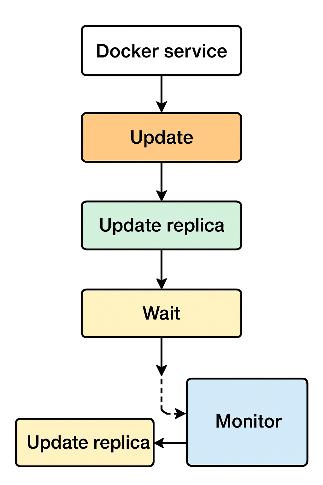

# Descripcion
Aplicar Rolling Updates en Docker Swarm Services and Stacks

## Steps

- **STEP_01**: Crete a service
    If the service not exist the arguments --update will be use for future updates as updtae strategy

    ```
    $ docker service create \
        --name my-web-replica \
        --replicas 3 \
        --update-parallelism 1 \
        --update-delay 10s \
        --update-monitor 30s \
        --update-failure-action rollback \
        --update-order start-first \
        ofertoio/my-web-replica:1.0.0
    ```

    where:

    ```
    --update-parallelism 1           --> Update 1 replica at a time (rolling)
    --update-delay 10s	             --> Wait 10 seconds between updating replicas
    --update-monitor 30s             --> Monitor each update for 30s before marking success
    --update-failure-action rollback --> If update fails then rollback automatically
    --update-order start-first	     --> Start new container before stopping old one (zero downtime)
    ```

- **STEP_02**: Updating Swarm Service (Rolling Update)

    In the case the service was created before without any update strategy ypu can set this strategy in the update execution. If the
    update strategy was set in the creation, is not need set this values again (only if you want change the previous strategy):

    ```
    docker service update \
        --image ofertoio/my-web-replica:2.0.0 \
        --update-parallelism 1 \
        --update-delay 10s \
        --update-order start-first \
    my-web-replica
    ```

    
    Swarm will:

    1. Start 1 new container (update-parallelism=1)
    2. Wait until it's healthy
    3. Stop 1 old container
    4. Repeat until all replicas are updated


- **STEP_03**: Updating Swarm Stacks (Rolling Update)

    Deploy stack:

    ```
    $ docker stack deploy -c docker-compose.yml my-web-replica
    ```

    Update stack (Rollong Update)

    ```
    $ docker service update --image ofertoio/my-web-replica:2.0.0 my-web-replica_web
    ```
    
    ```
    $ docker service rollback my-web-replica_web
    ```

- **STEP_04**:

    If you want see the update strategy:

    ```
    $ docker service inspect  my-web-replica_web
    ```

        
    